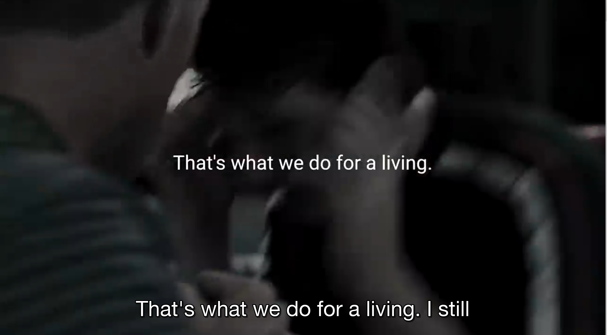

# Subtitles generator

Testing ffmpeg and wit.ai dictation feature for  speech to text convertion. this command takes in params the path to a video and generates video subtitles.



### Usage

Get your access token from wit.ai and add it to the env file
```
WIT_ACCESS_TOKEN=
```
Install ffmpeg
```
brew install ffmpeg
```

Install dependencies
```
npm install
```
To run the app
```
node index.js -i input.mp4  
```
